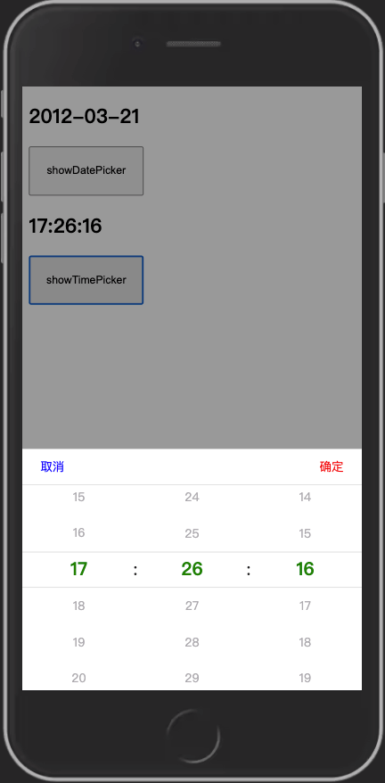

# svelte-mobile-datepicker

A Svelte datepicker for moble web

# preview

# Installation
```bash
npm install svelte-mobile-datepicker
```

# Usage

### datePicker
```html
<h2>{birthday}</h2>

<button on:click="{showPicker}">show</button>

<Datepicker 
  startDate="{start}" 
  endDate="{end}"
  format="{format}"
  confirmText="{confirmText}"
  cancelText="{cancelText}"
  bind:this="{picker}"
  bind:value={birthday} />

<script lang="ts">
  import { Datepicker } from 'svelte-mobile-datepicker'
  import 'svelte-mobile-datepicker/dist/index.min.css'

  let picker: Datepicker

  let birthday: string = '2012-03-21'

  let start: Date = new Date('1980-01-01') // optional, default new Date('1960-01-01')
  let end: Date = new Date() // optional, default new Date('2050-12-31')
  let format: string = 'YYYY-MM-DD' // optional, default 'YYYY-MM-DD'
  let confirmText: string = '确定' // optional, default '确定'
  let cancelText: string = '取消' // optional, default '取消'

  function showPicker () {
    picker.show()
  }
</script>

<style>
  :root{
    /* here to change color */
    --mask-color: rgba(0, 0, 0, .4);
    --picker-background-color: #fff;
    --confirm-text-color: red;
    --cancel-text-color: blue;
    --selected-color: green;
  }
  button{
    width: 200px;
    height: 80px;
  }
</style>
```

### timePicker
```html
<h2>{time}</h2>

<button on:click="{showTimePicker}">showTimePicker</button>

<TimePicker 
  needSecond="{needSecond}"
  bind:this="{timePicker}"
  confirmText="{confirmText}"
  cancelText="{cancelText}"
  bind:this="{timePicker}"
  bind:value={time} />

<script lang="ts">
  import { TimePicker } from '../src/TimePicker.svelte'
  import 'svelte-mobile-datepicker/dist/index.min.css'

  let timePicker: TimePicker

  let needSecond: boolean = false // optional, default false

  let time: string = needSecond ? '14:23:12' : '14:12'

  let startHour: number = 0 // optional, default 0
  let endHour: number = 23 // optional, default 23
  let startMinute: number = 0 // optional, default 0
  let endMinute: number = 59 // optional, default 59

  let confirmText: string = '确定' // optional, default '确定'
  let cancelText: string = '取消' // optional, default '取消'

  function showTimePicker () {
    timePicker.show()
  }
</script>

<style>
  :root{
    /* here to change color */
    --mask-color: rgba(0, 0, 0, .4);
    --picker-background-color: #fff;
    --confirm-text-color: red;
    --cancel-text-color: blue;
    --selected-color: green;
  }
  button{
    width: 200px;
    height: 80px;
  }
</style>
```